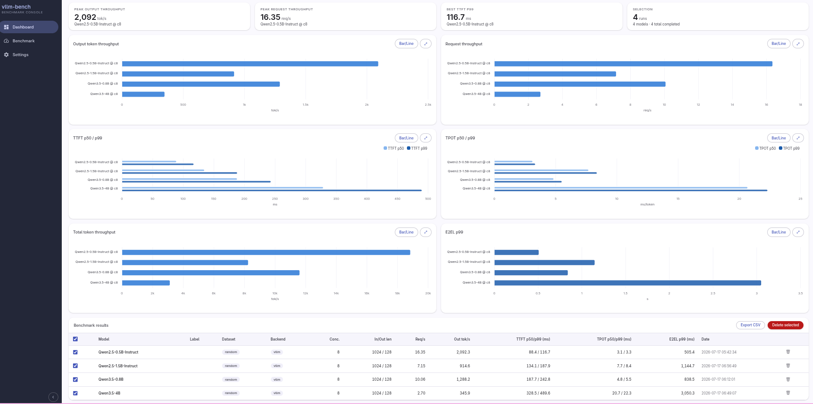
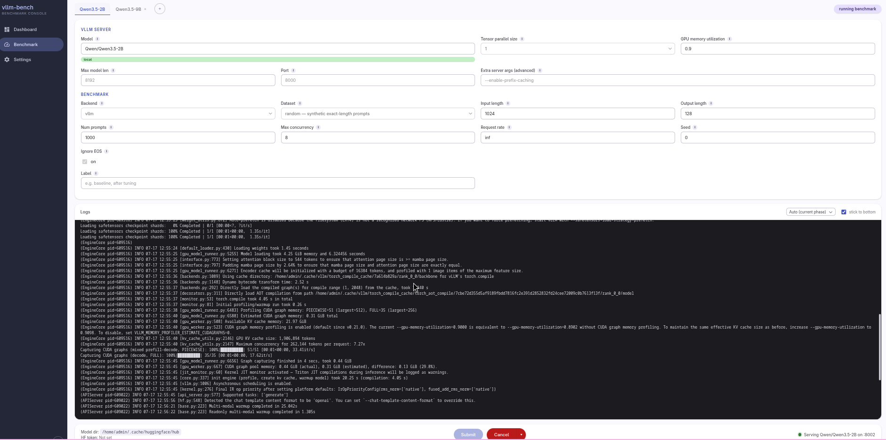
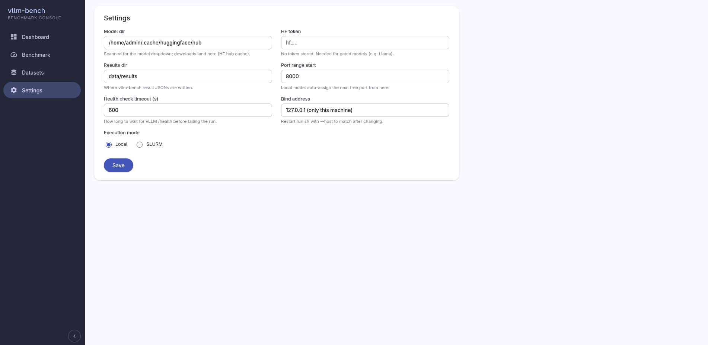

# vllm-bench GUI

This is the repo root. The application lives in
[`vllm-bench-gui/`](vllm-bench-gui/README.md) — start there for setup and
usage instructions.

- [`vllm-bench-gui/README.md`](vllm-bench-gui/README.md) — main app README
- [`vllm-bench-gui/CLAUDE.md`](vllm-bench-gui/CLAUDE.md) — app-specific dev notes
- [`vllm-bench-gui/test.md`](vllm-bench-gui/test.md) — manual/automated test plan
- [`vllm/`](vllm/) — original benchmark binary and container placeholder

## Screenshots

### Dashboard

### Benchmark

### Settings

